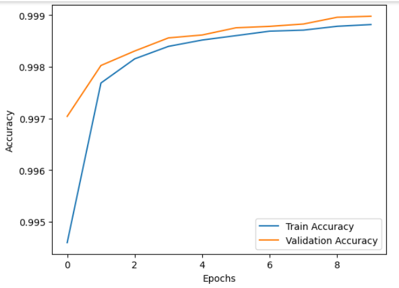
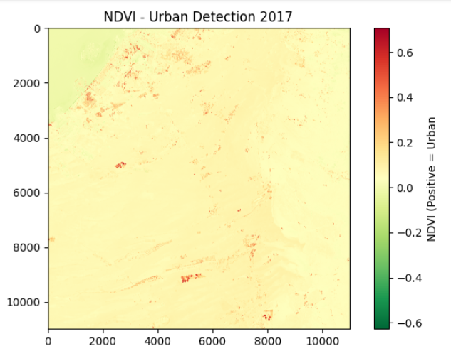
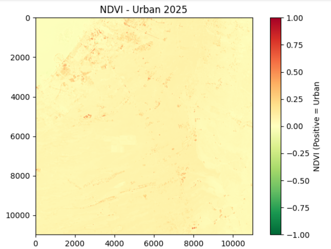
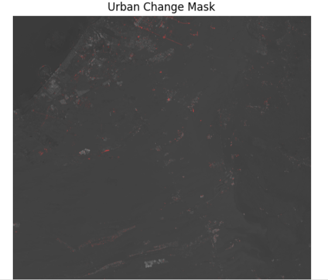

# Urban Change Detection using AI and Satellite Data

## Description

This project uses deep learning to detect urban changes using NDVI (Normalized Difference Vegetation Index) derived from Sentinel-2 satellite data.

## 📌 Project Overview

- Data Source: Sentinel-2 (from Copernicus Data Space Ecosystem)
- Input Data : Bands B04 (Red) and B08 (NIR) from two time periods
- Index Used : NDVI (Normalized Difference Vegetation Index)
- Model      : U-Net architecture built and trained from scratch
- Output     : Binary change map highlighting urban changes

## Model results

## Output

## Result

## 🧠 Workflow

1. Data Preparation
- Downloaded two Sentinel-2 images of the same location, different dates
- Extracted B04 and B08 bands
- Computed NDVI for both time periods

2. Model Training
- Built a U-Net model with 2-channel input (NDVI_old, NDVI_new)
- Trained on patches extracted from change-labeled NDVI images
- Applied data cleaning and handled overfitting using dropout

3. Inference
- Loaded trained model (`model.h5`)
- Predicted change map on full-size NDVI images
- Applied visual enhancement (red overlay on NDVI background)

## 🚀 Project Structure

urban-change-detection/
├── satellite data/
│ └── img_data_2017 / img_data_2025
├── model/
│ └── model.h5
├── notebooks/
│ └── Analysis & Training_Model.ipynb
├── scripts/
│ └── change_detection.py
├── output/
│ ├── ndvi_2017.PNG
│ ├── ndvi_2025.PNG
│ └── change_result.PNG
├── README.md

## 💻 Technologies Used

- Python

- Numpy

- Matplotlib

- Rasterio

- TensorFlow / Keras

- Satellite Data: Copernicus / Sentinel-2

